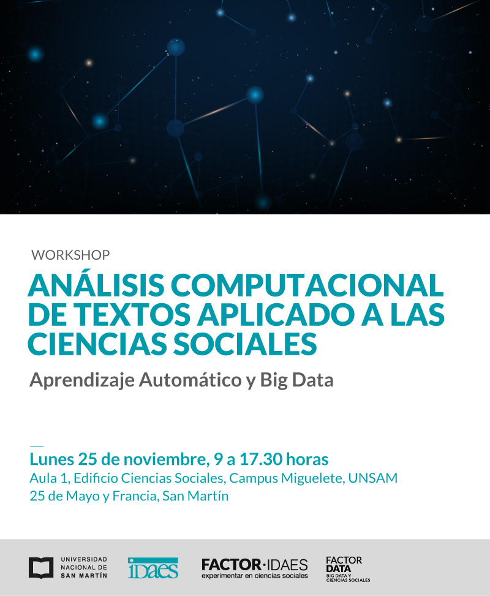

[]

## Exposiciones
- Diego Koslowski et al, [_Estereotipos de género en revistas argentinas. Un caso de revistas argentinas
	en el período 2008-2018_](/slides/01_kozlowski.pdf)
- Facundo Carrillo, [_Psiquatría computacional_](/slides/02_carrillo.pdf)
- Carla Palaviccini et al, [_Estudio fenomenológico del consumo de cannabis: Análisis de reportes de
	usuarios de más de 887 cepas en cuanto a efectos subjetivos y percepciones de aroma y sabor_](/slides/03_pallavicini.pdf)
- Sebastián Pinto et al, [_Agenda Mediática y Opinión Pública: Desarrollo de un marco cuantitativo basado en 
	procesamiento de lenguaje natural (NLP)_](/slides/04_pinto.pdf)
- [Germán Rosati](https://gefero.github.io), [_Testeando una hipótesis de Borges sobre el tango Una aplicación de topic modeling y algunos otros
	experimentos en letras de tango..._](/slides/05_rosati.pdf)

## Taller de Minería de Texto (a cargo de [Diego Koslowski](https://sites.google.com/view/diego-kozlowski/home))

### Temas
- Modelos de representación de textos (Bag of Words)
- Normalización
- Distancia de palabras y documentos
- Topic Modelling: detección de temas aplicada a tuits sobre el golpe de estado en Bolivia

[Descarga de Materiales](https://diegokoz.github.io/workshop_text_mining/)

